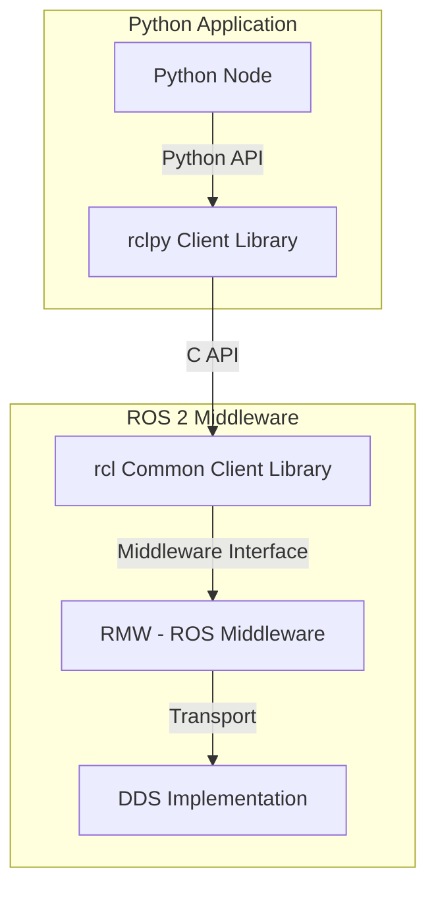
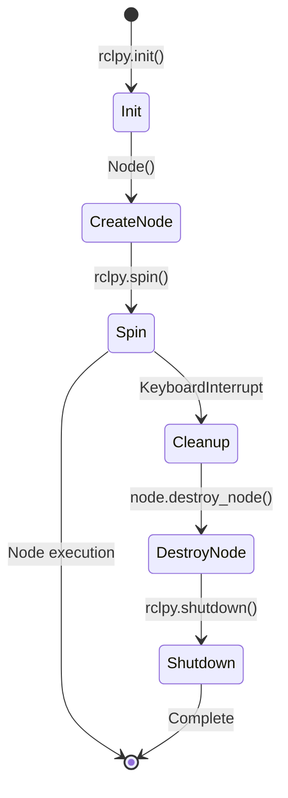

# rclpy Architecture: Python-ROS Integration

This section illustrates how Python integrates with ROS 2 through the rclpy library.

## rclpy Architecture Overview

The following diagram shows how rclpy fits into the ROS 2 architecture:

### Components Explained:

- **Python Node**: Your Python application code using rclpy
- **rclpy**: Python client library that provides ROS 2 functionality
- **rcl**: Common C client library shared across all ROS 2 client libraries
- **RMW**: ROS Middleware layer that abstracts the underlying transport
- **DDS**: Data Distribution Service that handles message transport

## Node Lifecycle with rclpy

This diagram shows the lifecycle of a Python node using rclpy:

## Summary

The rclpy architecture enables clean separation between application logic and ROS 2 middleware with consistent API across different DDS implementations.