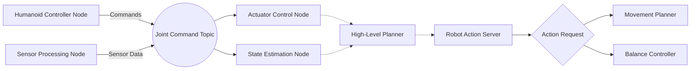
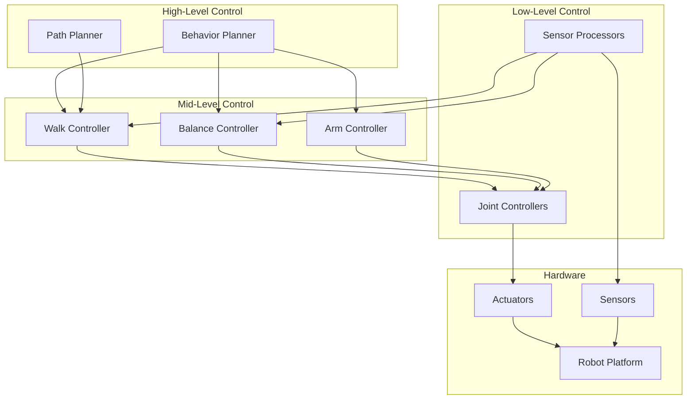
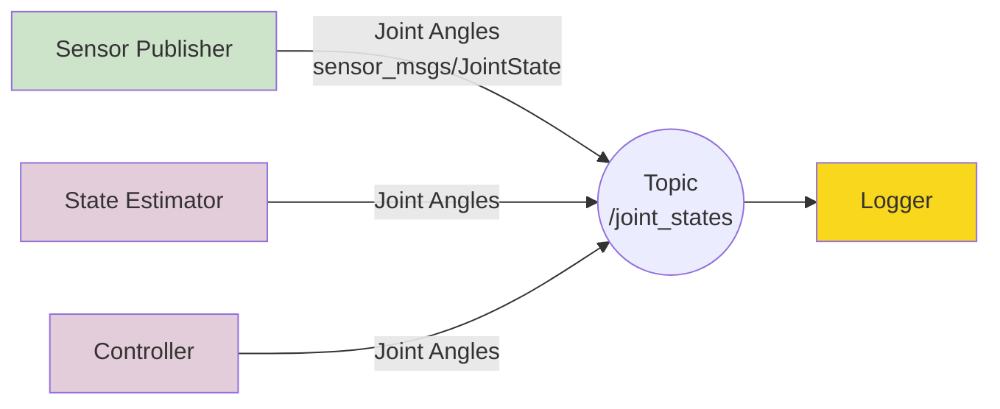
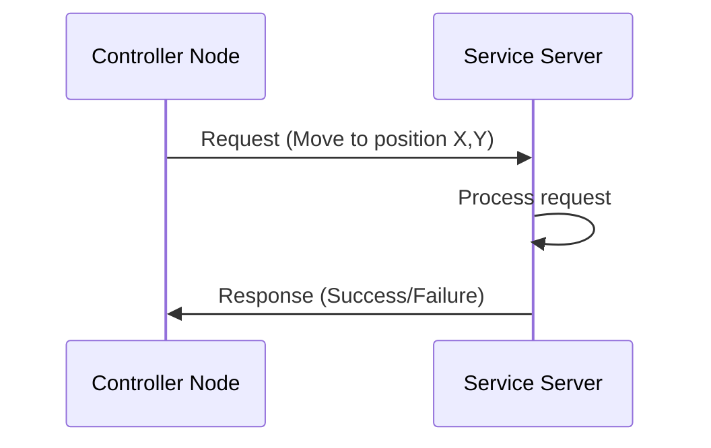
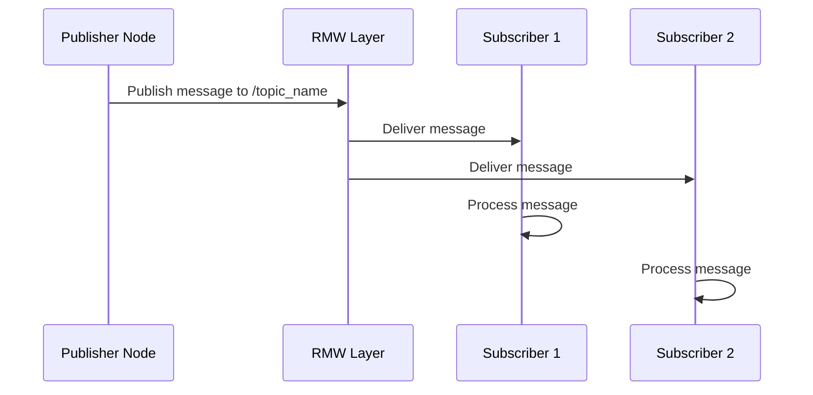
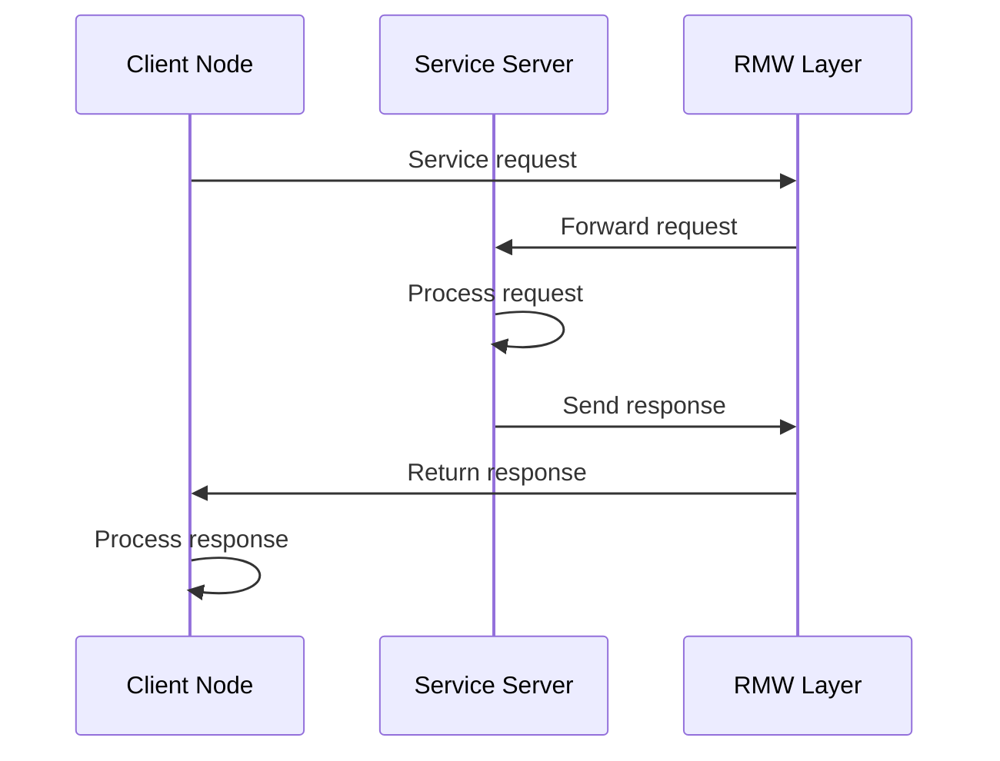

# ROS 2 Architecture Diagrams

This section illustrates the core architecture of ROS 2 systems using diagrams to visualize how components interact in humanoid robot applications.

## Node Communication Architecture

The following diagram shows how nodes communicate in a ROS 2 system:

### Key Components:

- **Nodes**: Individual processes that perform computation (rectangles)
- **Topics**: Communication channels for asynchronous message passing (ovals)
- **Services/Actions**: Synchronous communication for specific requests (diamonds)
- **Communication Links**: Data flow between components (arrows)

## Humanoid Robot Control Architecture

This diagram shows a typical control architecture for a humanoid robot:

## Publisher-Subscriber Pattern

This diagram illustrates the publisher-subscriber communication pattern:

### Legend:
- Green: Publishers (produce data)
- Purple: Subscribers (consume data)
- Yellow: Tools (special subscribers)

## Service Architecture

This diagram shows the service request-response pattern:

## Publisher-Subscriber Workflow

This sequence diagram shows the detailed workflow of the publisher-subscriber pattern:

## Service Request-Response Pattern

This sequence diagram shows the service request-response communication pattern:

## Summary

These diagrams illustrate the distributed nature of ROS 2 systems where:
- Nodes run independently and communicate through topics, services, and actions
- Multiple nodes can subscribe to the same topic (broadcasting)
- Topics enable loose coupling between nodes
- Services provide direct request-response communication
- The architecture supports both real-time control and high-level planning