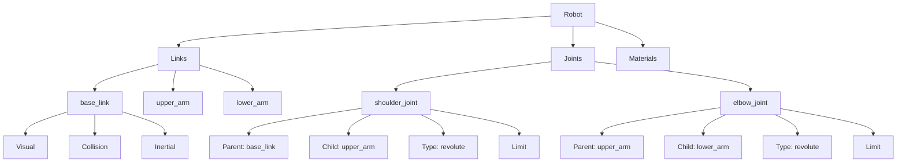
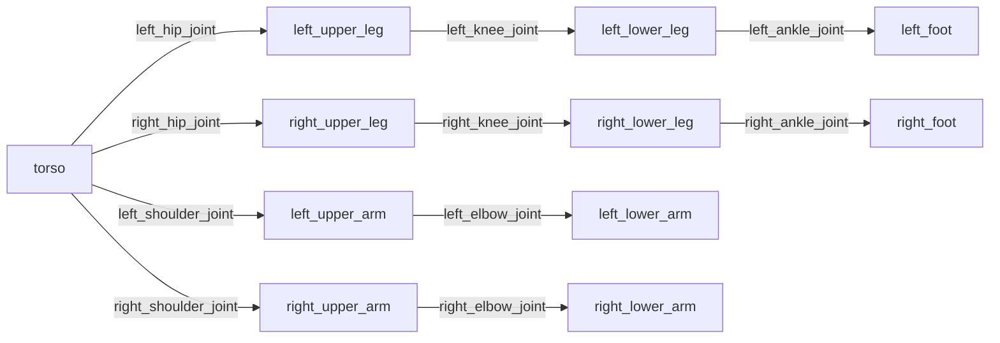
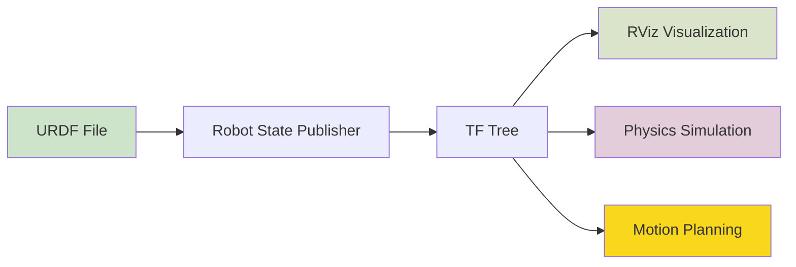
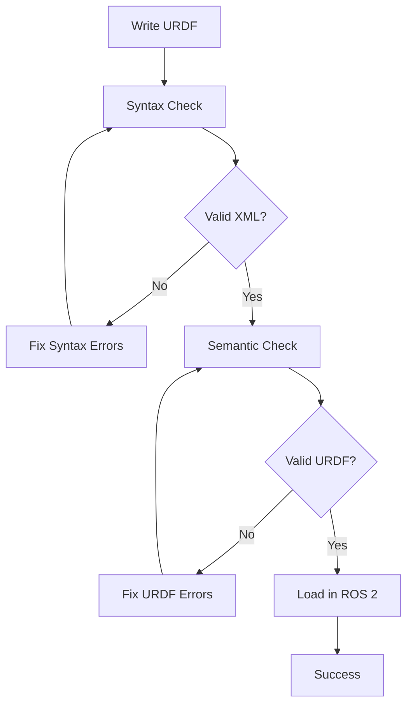

# URDF Structure and Visualization

This section illustrates the structure of URDF files and how they represent robot models in ROS 2.

## URDF XML Hierarchy

The following diagram shows the hierarchical structure of a URDF file:



### Key Components:

- **Robot**: Root element that contains the entire robot description
- **Links**: Rigid bodies that make up the robot structure
- **Joints**: Connections between links that define how they can move relative to each other
- **Materials**: Visual properties like color and texture

## Robot Kinematic Structure

This diagram shows how links and joints form the kinematic chain of a robot:



## URDF to Robot Model Pipeline

This flowchart shows how URDF files are processed in ROS 2:



## Common URDF Elements

### Link Structure
```
<link name="link_name">
  <visual>
    <geometry>
      <cylinder length="0.1" radius="0.05"/>
    </geometry>
    <material name="red"/>
  </visual>
  <collision>
    <geometry>
      <cylinder length="0.1" radius="0.05"/>
    </geometry>
  </collision>
  <inertial>
    <mass value="1.0"/>
    <inertia ixx="0.1" ixy="0" ixz="0" iyy="0.1" iyz="0" izz="0.1"/>
  </inertial>
</link>
```

### Joint Structure
```
<joint name="joint_name" type="revolute">
  <parent link="parent_link"/>
  <child link="child_link"/>
  <origin xyz="0 0 0.1" rpy="0 0 0"/>
  <axis xyz="0 0 1"/>
  <limit lower="-1.57" upper="1.57" effort="10" velocity="1"/>
</joint>
```

## URDF Validation Process

This diagram shows the process for validating URDF files:



## Summary

URDF files provide a standardized way to describe robot geometry and kinematics. The XML structure defines the robot as a collection of links connected by joints, which ROS 2 tools use for visualization, simulation, and planning.